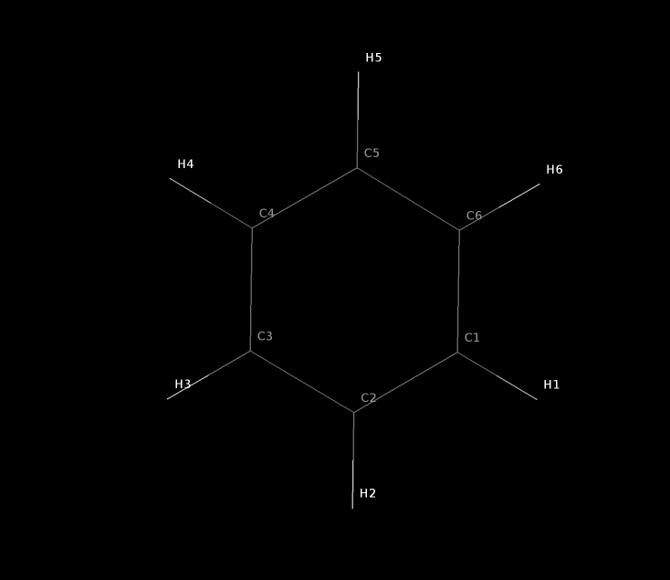
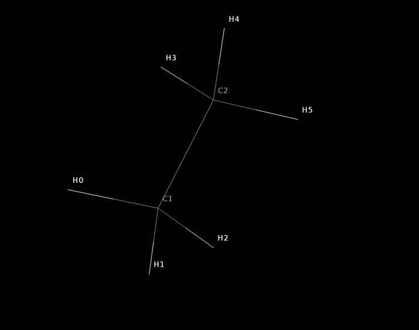
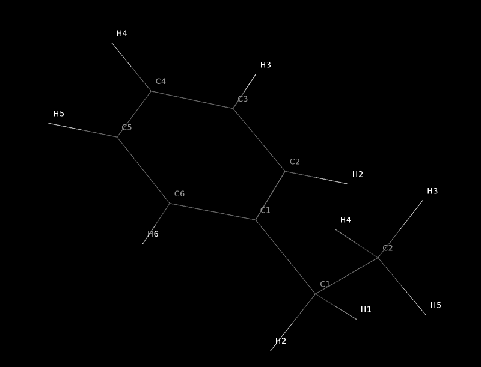
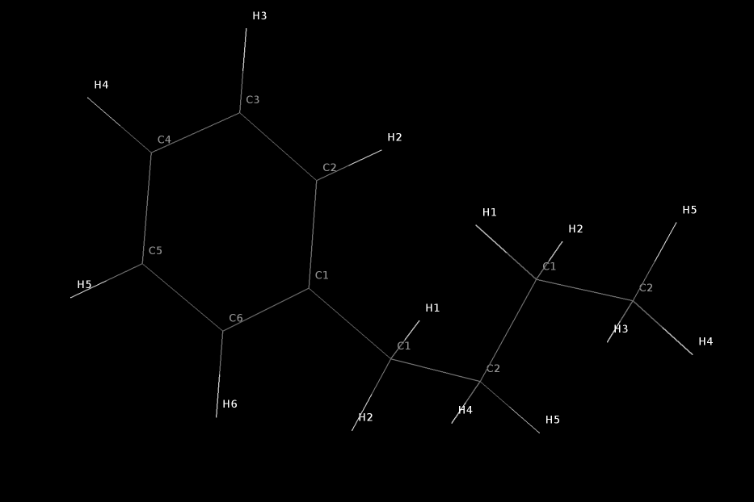
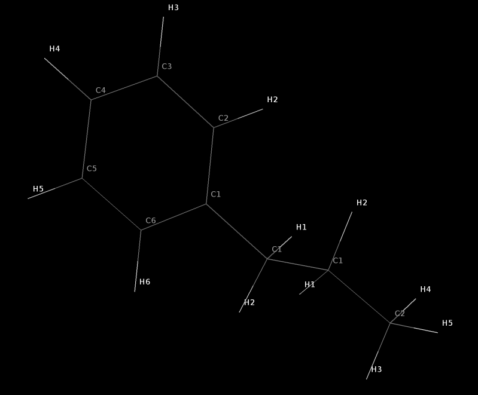

## Protein data bank format command line interface molecule builder - PDBclimb
## Introduction - June 2023

The code PDBclimb code constitutes a very basic command line interface molecule builder for molecules
in protein data bank (PDB) format.


It is intended as a set of scripts to be used as 'molecular scissors'. 
This code was created to meet the following basic requirements
	
	 * Snipping and joining' 3D molecular graphs - for molecules stored PDB format files.
	 * Specify the atoms involved by atom name and residue number - not a numeric atom index
	 * Allow very specific control over residue names an numbers as part of the building process

Note that this process occurs by 'snipping' and 'joining' single bonds, not double or triple bonds.
Note that the snipping and joining single bond should not be a ring bond. 

As the name implies it operates only on protein data bank (PDB) format files. The code is written 
in Python (was Python2 but now Python3) and should run easily on any machine with Python3 installed.


The scripts were created for the purpose of building PDB format files of small oligosaccharide 
sugar molecules, and many of these examples reflect this. However the codes are completely general 
and can be used for any type of molecule in PDB format. The code is relatively simple in that
it focuses on the so called HETATM and ATOM records of PDB files. It does not seek to manipulate 
and deal with the CONECT records specifying bonds between atoms. 

In the process of 'snipping' and 'joining' PDB files, the cut points and the join points in the 
process are specified by using atom names and residue numbers. Hence in building any new PDB file for a molecular 
structure of significant size, some understanding of the atom names and residue numbers used is required. 
Here we will show an example of using the underlying base level scripts, to build a new PDB file for a 
desired molecular structure. 

NB For viewing the 3D struture of molecules saved as PDB files, seeing the atom names etc. I find the Jmol java based 
desktop viewer to be very valuable. You can find more details of that program here:

https://jmol.sourceforge.net/

Many of the images used in this docuentation are created with Jmol. 

## Example 1a - create ethylbenzene from benzene and an ethyl 'fragment' (the hard way).

In this first example we start with a PDB file for benzene, we snip off one of the H atoms and join the benzene C atom 
to a C atom in ethane to form Ethylbenzene. This is a a trivial example but illustrates how the code works. 

Using Jmol we can visualise the 'stick picture' of benzene and the atom names which are shown below:


Looking at the contents of the corresponding PDB file , called benzene.pdb we see the following contents:

```
HETATM    1  C1  BNZ     1       1.383  -0.222   0.006  1.00  0.00           C  
HETATM    2  C2  BNZ     1       0.506  -1.307  -0.008  1.00  0.00           C  
HETATM    3  C3  BNZ     1      -0.871  -1.091  -0.015  1.00  0.00           C  
HETATM    4  C4  BNZ     1      -1.373   0.211  -0.004  1.00  0.00           C  
HETATM    5  C5  BNZ     1      -0.497   1.296   0.011  1.00  0.00           C  
HETATM    6  C6  BNZ     1       0.881   1.080   0.014  1.00  0.00           C  
HETATM    7  H1  BNZ     1       2.456  -0.390   0.010  1.00  0.00           H  
HETATM    8  H2  BNZ     1       0.897  -2.321  -0.014  1.00  0.00           H  
HETATM    9  H3  BNZ     1      -1.554  -1.936  -0.027  1.00  0.00           H  
HETATM   10  H4  BNZ     1      -2.447   0.379  -0.008  1.00  0.00           H  
HETATM   11  H5  BNZ     1      -0.888   2.310   0.019  1.00  0.00           H  
HETATM   12  H6  BNZ     1       1.564   1.925   0.024  1.00  0.00           H  
```

So that the 'residue name' used here is BNZ and the 'residue number' is 1.
The operations to be performed are to 'snip off' atom H1 - denoted as 1.H1 and join
the ethyl fragment to atom C1 denoted 1.C1. 

The ethyl fragment is actually stored in a PDB file with 6 atoms, i.e. that corresponding to ethane.
This is because one atom in a fragment PDB file is 'snipped off' while a second atom is used to join 
the resulting fragment to the remains of the benzene structure (after snipping off benzene 1.H1).
The atom names in the ethyl fragment PDB file are as shown below. 



The PDB file corresponding to the 6 atoms of the ethyl fragment is shown below. 

```
ATOM      1  C1  eth     1       0.000   0.000   0.000
ATOM      2  H0  eth     1       1.109   0.000   0.000
ATOM      3  H1  eth     1      -0.337   1.057   0.000
ATOM      4  H2  eth     1      -0.337  -0.462   0.950
ATOM      1  C2  eth     1      -0.550  -0.752  -1.202
ATOM      2  H3  eth     1      -0.211  -0.291  -2.152
ATOM      3  H4  eth     1      -0.214  -1.809  -1.202
ATOM      4  H5  eth     1      -1.659  -0.750  -1.203
```

This brings us to an important convention in using this code, namely that the first atom in a 'fragment' PDB file 
is the atom used in joining to a another molecular structure - it is the 'join atom'. The second atom in a 
'fragment' PDB file is the atom 'snipped off' - it is the deleted atom. This is done for convenience in usage, i.e.
that the deletion and join atoms in a 'fragment' PDB file do not need to be remembered, because they are hard coded. 

In the build process we start with a intial PDB file , such as benzene.pdb. Then we join a fragment to that which then becomes
the 'current' molecule or PDB file. Then we can add a second fragment to the current molecule or PDB file. Add a third fragment etc. 
All intermediate stages result in a new PDB file. Hence the current implmentation outputs a lot of temporary files rather than operating strictly 
in memory (I might get to that later). 

One way of creating the ethylbenzene molecule is to use one of the 'base' scripts, namely pdb_join_fragment.py
To run this and create an output PDB file on STDOUT , we can use a command of the form 

```
	./pdb_join_fragment.py benzene.pdb 1.H1 1.C1 frag/frag_ethyl.pdb
```
where benzene.pdb is in the current folder and the ethyl fragent PDB file is called frag_ethyl.pdb in a subfolder called frag.

The output on STDOUT looks like this 

```
REMARK joinatom= 1.C1
REMARK Fragemnt PDB file= frag/frag_ethyl.pdb
REMARK bond length for  C1  and  C1  set to  1.52
REMARK Initial bump distance= 2.275472902447087
REMARK Final bump distance= 2.4232444318277504
ATOM      1  C1  BNZ     1       0.000   0.000   0.000
ATOM      2  C2  BNZ     1       1.208   0.011  -0.699
ATOM      3  C3  BNZ     1       1.207   0.013  -2.093
ATOM      4  C4  BNZ     1      -0.001  -0.000  -2.790
ATOM      5  C5  BNZ     1      -1.209  -0.013  -2.092
ATOM      6  C6  BNZ     1      -1.209  -0.011  -0.697
ATOM      8  H2  BNZ     1       2.149   0.019  -0.156
ATOM      9  H3  BNZ     1       2.148   0.023  -2.637
ATOM     10  H4  BNZ     1      -0.001  -0.000  -3.877
ATOM     11  H5  BNZ     1      -2.150  -0.023  -2.635
ATOM     12  H6  BNZ     1      -2.149  -0.019  -0.153
ATOM      1  C1  eth     1      -0.000   0.000   1.520
ATOM      3  H1  eth     1       0.915  -0.529   1.857
ATOM      4  H2  eth     1      -0.875  -0.592   1.857
ATOM      5  C2  eth     1      -0.050   1.417   2.070
ATOM      6  H3  eth     1       0.824   2.009   1.731
ATOM      7  H4  eth     1      -0.966   1.945   1.734
ATOM      8  H5  eth     1      -0.048   1.417   3.179
```

Where the REMARK lines indicate the fragment file used, the C-C bond length set and 
the results of a bump  check and torsion scan around the new C-C bond to minimise steric clashes.

Viewing this output in Jmol shows the ethylbenzene structure has been created as desired.



However it should be noted that both the benzene (or phenyl) group and the ethyl group are both 
still designated as residue number 1, hence this is not ideal for a PDB file as, for example,
there are two C atoms named C1 and denoted as 1.C1 in residue 1.

It would have been nicer to denote the ethyl fragment as residue number 2, then join this to 
the benzene molecule. Using the base level scripts in this code. This residue renumbering can be achieved 
and the join enabled using this pair of commands. 

```
	./pdb_set_resnumber.py frag/frag_ethyl.pdb 2 > temp_ethyl.pdb
	./pdb_join_fragment.py benzene.pdb 1.H1 1.C1 temp_ethyl.pdb

```

The resulting output is then as follows. 

```
REMARK joinatom= 1.C1
REMARK Fragemnt PDB file= temp_ethyl.pdb
REMARK bond length for  C1  and  C1  set to  1.52
REMARK Initial bump distance= 2.275472902447087
REMARK Final bump distance= 2.4232444318277504
ATOM      1  C1  BNZ     1       0.000   0.000   0.000
ATOM      2  C2  BNZ     1       1.208   0.011  -0.699
ATOM      3  C3  BNZ     1       1.207   0.013  -2.093
ATOM      4  C4  BNZ     1      -0.001  -0.000  -2.790
ATOM      5  C5  BNZ     1      -1.209  -0.013  -2.092
ATOM      6  C6  BNZ     1      -1.209  -0.011  -0.697
ATOM      8  H2  BNZ     1       2.149   0.019  -0.156
ATOM      9  H3  BNZ     1       2.148   0.023  -2.637
ATOM     10  H4  BNZ     1      -0.001  -0.000  -3.877
ATOM     11  H5  BNZ     1      -2.150  -0.023  -2.635
ATOM     12  H6  BNZ     1      -2.149  -0.019  -0.153
ATOM      1  C1  eth     2      -0.000   0.000   1.520
ATOM      3  H1  eth     2       0.915  -0.529   1.857
ATOM      4  H2  eth     2      -0.875  -0.592   1.857
ATOM      5  C2  eth     2      -0.050   1.417   2.070
ATOM      6  H3  eth     2       0.824   2.009   1.731
ATOM      7  H4  eth     2      -0.966   1.945   1.734
ATOM      8  H5  eth     2      -0.048   1.417   3.179
```

If we wished to also rename the 'eth' residue to 'ETH' then a script exists to 
also  do that , but performing these lower level operations one at a time is tedious. 

## Example 1b create ethylbenzene from benzene and an ethyl fragment (the easy way)

The more convenient way to build this simple molecule is to use the molbuild.py script. 
This uses a text based 'build' file that also renames and renumbers the residues in a single step. 

```
# Define files to be used
# Also renumber and rename residues in molecule file 
# The 'use' command define a shorthand to molecules to be used 
# It also allows residue names and numbers to be set conveniently 

use benzene.pdb as mol1 resnumber 1 resname BEN 
use frag/frag_ethyl.pdb as mol2 resnumber 2 resname ETH 

# join molecule and fragment PDB files

join mol1 1.H1 1.C1 fragment mol2
save my_ethylbenzene.pdb 
```

Note that lines starting with a hash (or pound) character are a comment. 
The syntax of the use command is simple is creates a shortcut for a molecule or fragment 
and allows the residue names and numbers to be set in one go. 
The join command then specifies the 'snip off' point in the the current molecule and the fragment to be joined.

The output saved in the file my_ethylbenene.pdb then looks as follows:

```
REMARK Filename =  temp_mol1.pdb
REMARK delatom= 1.H1
REMARK joinatom= 1.C1
REMARK Fragemnt PDB file= temp_mol2.pdb
REMARK bond length for  C1  and  C1  set to  1.52
REMARK Initial bump distance= 2.275472902447087
REMARK Final bump distance= 2.4232444318277504
ATOM      1  C1  BEN     1       0.000   0.000   0.000
ATOM      2  C2  BEN     1       1.208   0.011  -0.699
ATOM      3  C3  BEN     1       1.207   0.013  -2.093
ATOM      4  C4  BEN     1      -0.001  -0.000  -2.790
ATOM      5  C5  BEN     1      -1.209  -0.013  -2.092
ATOM      6  C6  BEN     1      -1.209  -0.011  -0.697
ATOM      8  H2  BEN     1       2.149   0.019  -0.156
ATOM      9  H3  BEN     1       2.148   0.023  -2.637
ATOM     10  H4  BEN     1      -0.001  -0.000  -3.877
ATOM     11  H5  BEN     1      -2.150  -0.023  -2.635
ATOM     12  H6  BEN     1      -2.149  -0.019  -0.153
ATOM      1  C1  ETH     2      -0.000   0.000   1.520
ATOM      3  H1  ETH     2       0.915  -0.529   1.857
ATOM      4  H2  ETH     2      -0.875  -0.592   1.857
ATOM      5  C2  ETH     2      -0.050   1.417   2.070
ATOM      6  H3  ETH     2       0.824   2.009   1.731
ATOM      7  H4  ETH     2      -0.966   1.945   1.734
ATOM      8  H5  ETH     2      -0.048   1.417   3.179
```

Note that if no 'save' command is used in the build.txt file then the current molecule is always saved
to a file called temp_current.pdb where the molbuild.py script is being run.

Note that 'under the hood' the molbuild.py script does call these lower level scripts to 
achieve the lower level operations, it simply offers a more covenient syntax and as
a command line molecule builder it offers some degree of automation. 

## Example 2 - Create Butylbenzene using the build script. 

As an easy example we can consider building butylbenzene as a multi step process.
First ensure we use benzene as our starting molecule (residue number 1, residue name BEN). 
Then ensure we have two ethyl 'fragments' available (residue numbers 2 and 3, residue name ETH). 
The we need 2 join operations. Firstly snip off 1.H1 (i.e. the H1 atom in benzene) and join on an ethyl fragment as residue number 2.
Then snip off atom 2.H3 (atom H3 in residue 2, which is attached to 2.C2) and join an ethyl fragment as residue number 3.

This needs a short build script with 3 use statments , 2 join statements and a save statment. 

```
# Create butylbenzene 

use benzene.pdb as mol1 resnumber 1 resname BEN 
use frag/frag_ethyl.pdb as mol2 resnumber 2 resname ETH 
use frag/frag_ethyl.pdb as mol3 resnumber 3 resname ETH 

# join molecule and fragment PDB files

join mol1 1.H1 1.C1 fragment mol2
join current 2.H3 2.C2 fragment mol3 
save my_butylbenzene.pdb 
```
The resulting structure can be inspected in Jmol



Note that if the my_butylbenzene.pdb file is inspected we have set the residue names and numbers as desired. 

## Example 3 - building propylbenzene 

Note that if we have decided to snip along the C1-C2 bond in the ethylbenzene molecule residue 2, the results would differ from that above. 
The result would have been to remove all atoms in the molecular graph at the C2 end of the current structure.
Then joining an ethyl fragment to atom C1 (denoted 2.C1) would result in a propylbenzene structure. 

Here is the build script 
```
# Create propylbenzene 

use benzene.pdb as mol1 resnumber 1 resname BEN 
use frag/frag_ethyl.pdb as mol2 resnumber 2 resname ETH 
use frag/frag_ethyl.pdb as mol3 resnumber 3 resname ETH 

# join molecule and fragment PDB files

join mol1 1.H1 1.C1 fragment mol2
# this join command removes all atoms at 2.C2 end of molecular graph
# then joins an ethyl fragment onto atom 2.C1
join current 2.C2 2.C1 fragment mol3 
save my_propylbenzene.pdb 
```

Here is what the resulting molecule looks like




This illustrates that the molbuild is not limited to (say) snipping along C-H or N-H bonds.
It can be used to snip along any single bond in the starting or current molecule.
It then truncates the molecular graph for (and beyond) the deleted atom. It then joins the specified fragment.
It runs a torsion scan bump check to remove steric clashes as best it can, it then saves the current structure as a PDB file. 

## Energy minimization of PDB files 

Note that this set of scripts do not include any tools for molecular mechanics, tasks such as energy minimisation.
There are plenty of existing tools to perform this task, as an example the Openbabel code , created by O'Boyle and 
co-workers has these features, and is described here.

	https://jcheminf.biomedcentral.com/articles/10.1186/1758-2946-3-33

If you have the conda (or mamba) package managers installed and available, then openbabel 
can easily be installed with  a commandi like this: 

```
	conda install -c conda-forge openbabel
```

Once this installed then the executables  such as obabel and obminimize will be available in the 
activated environment. 
As an example the my_propylbenzene structure created above can be energy minimized with a command such as.
 
```
	obminimize my_propylbenzene.pdb > opt_propylbenzene.pdb
```


