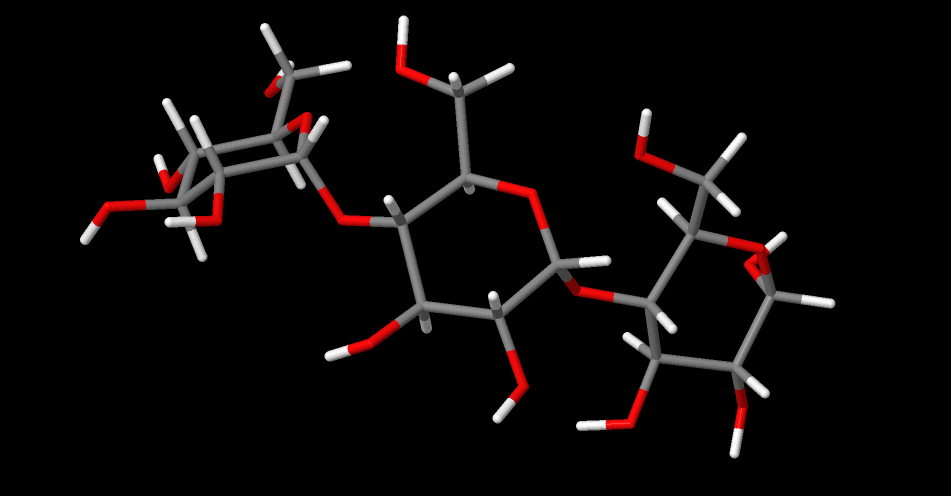

## Protein data bank format command line interface molecule builder - PDBclimb
## Description of scripts - June 2023

The code PDBclimb code constitutes a very basic command line interface molecule builder for molecules
in protein data bank (PDB) format.

The codebase for PDBclimb consists of a set of python3 scripts. Here we describe utility and 
usage of the individual scripts. 

## pdb_ringbond.py

A small utility script that can be used to check if a pair of bonded atoms form a ring. 
We test the script using a structure of beta-D-glucose where the PDB file for this structure 
has the atom names shown below. 


An example of the command line usage is as follows:

```
	./pdb_ringbond.py pdb/bdglc.pdb 1.C1 1.C2

```

which produces the output 

```
Filename =  pdb/bdglc.pdb
-------------------------------------------------
Testing for ring bond
Atom  3 C1 GLC 1 5.227 0.338 -8.248
Atom  5 C2 GLC 1 4.345 -0.412 -7.222
Ring size for this bond = 6

```

## pdb_get_torsion.py

A utility code for checking a torion angle in an exising PDB format structure file. 
Example of command line usage:

```
./pdb_get_torsion.py pdb/bdglc.pdb 1.C1 1.C2 1.C3 1.C4
```

Example of output:

```
Filename =  pdb/bdglc.pdb
Atom numbers for selected atoms = 3 5 7 9
Torsion angle (degrees)= 309.0673131706186
```

## pdb_set_torsion.py

This allows the setting of a specified torsion angle for a structure stored in a PDB file. 
An example of command line usage:
```
./pdb_set_torsion.py pdb/bdglc.pdb 1.H5 1.C5 1.C6 1.O6 60.00
```

The new coordinates are echoed to STDOUT - for example 

```
REMARK Filename =  pdb/bdglc.pdb
REMARK Atom numbers for selected atoms = 13 1 11 12
REMARK Initial torsion angle (degrees) = 54.38950439547297
REMARK New torsion angle (degrees)= 59.99999999999999
ATOM      1  C5  GLC     1       0.000   0.000   0.000
ATOM      2  O   GLC     1       1.316  -0.424  -0.439
etc.
ATOM     23  H62 GLC     1       0.205  -1.005   1.935
ATOM     24  H6  GLC     1      -1.152   0.449   3.026
```


## pdb_set_resname.py

Set the 'residue name' for all atoms in a selected PDB file. 
Example of command line usage:

```
./pdb_set_resname.py pdb/bdglc.pdb BDG
```

The modified information is echoed to STDOUT

```
REMARK Filename =  pdb/bdglc.pdb
ATOM      1  C5  BDG     1       3.337   1.774  -8.944
ATOM      2  O   BDG     1       4.702   1.679  -8.463
ATOM      3  C1  BDG     1       5.227   0.338  -8.248

etc

ATOM     22  H61 BDG     1       3.805   3.735  -9.772
ATOM     23  H62 BDG     1       3.014   3.809  -8.202
ATOM     24  H6  BDG     1       1.654   4.401  -9.918

```


## pdb_set_resnumber.py

Set the 'residue number' for all atoms in a selected PDB file. 


Example of command line usage:

```
./pdb_set_resnumber.py pdb/bdglc.pdb 3 
```

The modified information is echoed to STDOUT

```
REMARK Filename =  pdb/bdglc.pdb
ATOM      1  C5  GLC     3       3.337   1.774  -8.944
ATOM      2  O   GLC     3       4.702   1.679  -8.463
etc

ATOM     21  HO4 GLC     3       0.779   1.926  -8.640
ATOM     22  H61 GLC     3       3.805   3.735  -9.772
ATOM     23  H62 GLC     3       3.014   3.809  -8.202
ATOM     24  H6  GLC     3       1.654   4.401  -9.918
```

## pdb_join_fragment.py

This is the underlying building block of the PDBclimb code. 
Take current saved PDB format file, delete atoms on the 'wrong side' of the 'snipped' bond,
 then join the atoms in the specified fragment file. 

Example of command line usage:

```
./pdb_join_fragment.py pdb/bdglc.pdb 1.O2 1.C2 frag/frag_2oso3.pdb > sulphated.pdb
```

In this case the structure produced should be a monosaccharide sulpahted at the 2-position. 
This is can be seen using Jmol to inspect the structure obtained. 


Note that ideally the residue names and numbers for the fragment will also have been modified before the join.

## pdb_make_fragement.py

Convert a standard PDB file into a 'fragment' PDB file. This requires the definition of an 'inner' and 'outer' 
atom in the structure. All atoms beyond the 'outer' atom are removed, the inner atom becomes the first atom 
present in the PDB fragment file - i.e. the join atom. The outer atom becomes the second atom in the fragment PDB file.
This is then the atom deleted upon fragment joining.

Example of usage:

```
./pdb_make_fragment.py pdb/bdglc.pdb 1.O1 1.C1 >my_frag_1bdglc.pdb
```

In this case the outer atom is 1.O1 and the inner atom 1.C1

## molbuild.py

This is the central scipt used in PDB climb and it follows instructions to 
build (say) an oligosaccharide from existing PDB files using a textual build instructions file. 

Example of usage : 

```
 ./molbuild.py build_maltotriose.txt

``` 

Where the build instructions file is shown below.

```
# molbuild.py instructions to build maltotriose 

# define files to be used
use frag/frag_4adglc.pdb as mol1 resnumber 1 resname ADG
use frag/frag_4adglc.pdb as mol2 resnumber 2 resname ADG 
use frag/frag_4adglc.pdb as mol3 resnumber 3 resname ADG

# join molecule and fragment PDB files
join mol1 1.O1 1.C1 fragment mol2
join current 2.O1 2.C1 fragment mol3

# save output 
save maltotriose.pdb
```

The output structure is shown below using a Jmol rendered image




